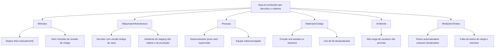

## Diagrama de Ishikawa em Mermaid

## Diagrama de Ishikawa
                            Bug em produção
                                   ↑
           ┌────────────┬────────────┬────────────┬────────────┐
           │            │            │            │            │
       MÉTODOS       MÁQUINAS     PESSOAS     MATERIAIS    MEDIÇÕES
     - Procedimento   - Máquina     - Falta      - Matéria    - Instrumento
       errado           mal         de treino      prima         descalibrado
                        regulada                  vencida
