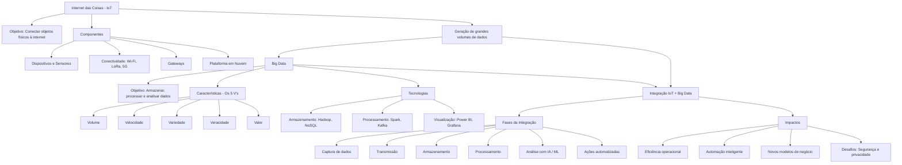
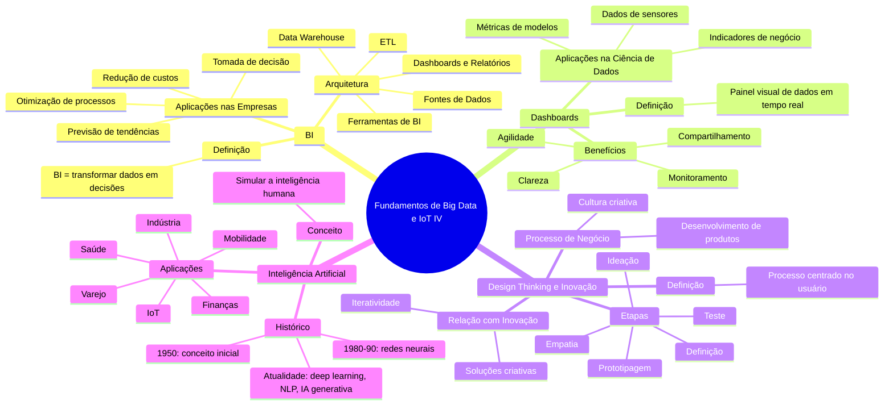
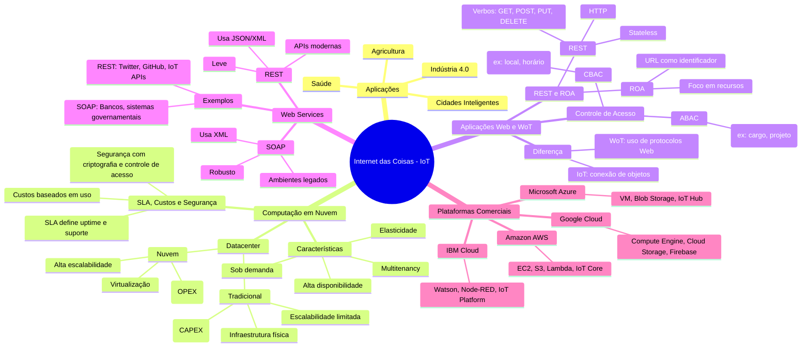
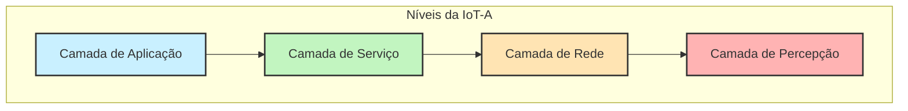
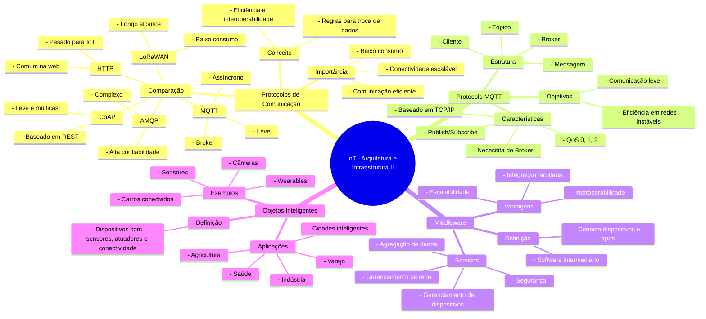

# mba-iot

## Resumo visual: Fundamentos de Big Data e Internet das Coisas II

```mermaid
graph TD
  A[Fundamentos de Big Data e IoT II] --> B[Aplicacoes da Ciencia de Dados]
  B --> B1[Onde aplicar]
  B1 --> B1a[Varejo, Saude, Financas, Industria, etc.]
  B --> B2[Exemplos praticos]
  B2 --> B2a[Netflix, Uber, Amazon]
  B --> B3[BI vs Ciencia de Dados]
  B3 --> B3a[BI: analise descritiva]
  B3 --> B3b[Ciencia de Dados: preditiva e prescritiva]

  A --> C[Aprendizado de Maquina]
  C --> C1[Definicao]
  C1 --> C1a[IA que aprende com dados]
  C --> C2[Tipos de aprendizado]
  C2 --> C2a[Supervisionado]
  C2 --> C2b[Nao supervisionado]
  C2 --> C2c[Reforco]
  C --> C3[Aplicacoes]
  C3 --> C3a[Reconhecimento de imagem e voz]
  C3 --> C3b[Fraudes, veiculos autonomos]

  A --> D[Introducao ao Hadoop]
  D --> D1[Definicao]
  D1 --> D1a[Framework distribuido]
  D --> D2[Componentes]
  D2 --> D2a[HDFS]
  D2 --> D2b[MapReduce]
  D2 --> D2c[YARN]
  D2 --> D2d[Hadoop Common]
  D --> D3[Caracteristicas]
  D3 --> D3a[Escalavel, tolerante a falhas, custo baixo]
  D --> D4[MapReduce]
  D4 --> D4a[Map: pares chave-valor]
  D4 --> D4b[Reduce: agregacao de resultados]

  A --> E[Mineracao de Dados]
  E --> E1[Definicao]
  E1 --> E1a[Descoberta de padroes]
  E --> E2[Etapas]
  E2 --> E2a[Selecao, pre-processamento, transformacao]
  E2 --> E2b[Mineracao, avaliacao, apresentacao]
  E --> E3[KDD]
  E3 --> E3a[Integracao, limpeza, reducao, interpretacao]
  E --> E4[Big Data]
  E4 --> E4a[5Vs: Volume, Velocidade, Variedade, Veracidade, Valor]
  E --> E5[Aplicacoes]
  E5 --> E5a[Fraudes, diagnostico medico, redes sociais]
```

## Fundamentos de Big Data e IoT IV

## Aplicações de Internet das Coisas

## Arquitetura de referência IoT-A (Internet of Things - Architecture)

- Camada de Percepção: sensores, RFID, atuadores — coleta dados do mundo físico.
- Camada de Rede: protocolos de comunicação e transporte dos dados coletados.
- Camada de Serviço: processamento, gerenciamento e armazenamento de dados.
- Camada de Aplicação: entrega os serviços ao usuário final (painéis, apps, relatórios).
## Arquitetura e Infraestrutura de IoT II

