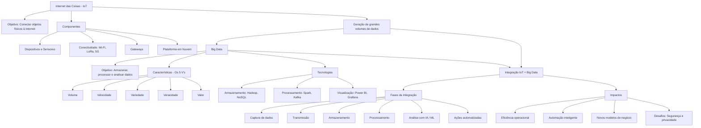
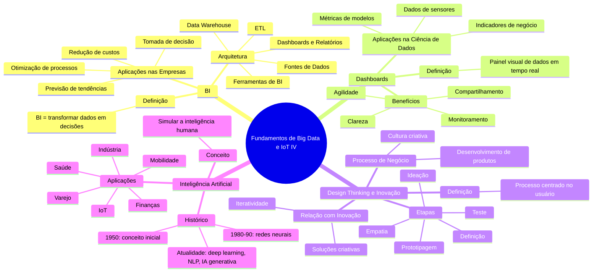

# mba-iot

```mermaid
graph TD
    A[Internet das Coisas - IoT] --> A1[Objetivo: Conectar objetos físicos à internet]
    A --> A2[Componentes]
    A2 --> A2a[Dispositivos e Sensores]
    A2 --> A2b[Conectividade: Wi-Fi, LoRa, 5G]
    A2 --> A2c[Gateways]
    A2 --> A2d[Plataforma em Nuvem]

    A --> A3[Geração de grandes volumes de dados]
    A3 --> B[Big Data]

    B --> B1[Objetivo: Armazenar, processar e analisar dados]
    B --> B2[Características - Os 5 V's]
    B2 --> B2a[Volume]
    B2 --> B2b[Velocidade]
    B2 --> B2c[Variedade]
    B2 --> B2d[Veracidade]
    B2 --> B2e[Valor]

    B --> B3[Tecnologias]
    B3 --> B3a[Armazenamento: Hadoop, NoSQL]
    B3 --> B3b[Processamento: Spark, Kafka]
    B3 --> B3c[Visualização: Power BI, Grafana]

    A3 --> C[Integração IoT + Big Data]
    B --> C

    C --> C1[Fases da Integração]
    C1 --> C1a[Captura de dados]
    C1 --> C1b[Transmissão]
    C1 --> C1c[Armazenamento]
    C1 --> C1d[Processamento]
    C1 --> C1e[Análise com IA / ML]
    C1 --> C1f[Ações automatizadas]

    C --> C2[Impactos]
    C2 --> C2a[Eficiência operacional]
    C2 --> C2b[Automação inteligente]
    C2 --> C2c[Novos modelos de negócio]
    C2 --> C2d[Desafios: Segurança e privacidade]
```
## Resumo visual: Fundamentos de Big Data e Internet das Coisas II

```mermaid
graph TD
  A[Fundamentos de Big Data e IoT II] --> B[Aplicacoes da Ciencia de Dados]
  B --> B1[Onde aplicar]
  B1 --> B1a[Varejo, Saude, Financas, Industria, etc.]
  B --> B2[Exemplos praticos]
  B2 --> B2a[Netflix, Uber, Amazon]
  B --> B3[BI vs Ciencia de Dados]
  B3 --> B3a[BI: analise descritiva]
  B3 --> B3b[Ciencia de Dados: preditiva e prescritiva]

  A --> C[Aprendizado de Maquina]
  C --> C1[Definicao]
  C1 --> C1a[IA que aprende com dados]
  C --> C2[Tipos de aprendizado]
  C2 --> C2a[Supervisionado]
  C2 --> C2b[Nao supervisionado]
  C2 --> C2c[Reforco]
  C --> C3[Aplicacoes]
  C3 --> C3a[Reconhecimento de imagem e voz]
  C3 --> C3b[Fraudes, veiculos autonomos]

  A --> D[Introducao ao Hadoop]
  D --> D1[Definicao]
  D1 --> D1a[Framework distribuido]
  D --> D2[Componentes]
  D2 --> D2a[HDFS]
  D2 --> D2b[MapReduce]
  D2 --> D2c[YARN]
  D2 --> D2d[Hadoop Common]
  D --> D3[Caracteristicas]
  D3 --> D3a[Escalavel, tolerante a falhas, custo baixo]
  D --> D4[MapReduce]
  D4 --> D4a[Map: pares chave-valor]
  D4 --> D4b[Reduce: agregacao de resultados]

  A --> E[Mineracao de Dados]
  E --> E1[Definicao]
  E1 --> E1a[Descoberta de padroes]
  E --> E2[Etapas]
  E2 --> E2a[Selecao, pre-processamento, transformacao]
  E2 --> E2b[Mineracao, avaliacao, apresentacao]
  E --> E3[KDD]
  E3 --> E3a[Integracao, limpeza, reducao, interpretacao]
  E --> E4[Big Data]
  E4 --> E4a[5Vs: Volume, Velocidade, Variedade, Veracidade, Valor]
  E --> E5[Aplicacoes]
  E5 --> E5a[Fraudes, diagnostico medico, redes sociais]
```
## Fundamentos de Big Data e IoT IV

```mermaid
mindmap
  root((Fundamentos de Big Data e IoT IV))

    BI
      Definição
        BI = transformar dados em decisões
      Arquitetura
        Fontes de Dados
        ETL
        Data Warehouse
        Ferramentas de BI
        Dashboards e Relatórios
      Aplicações nas Empresas
        Otimização de processos
        Previsão de tendências
        Redução de custos
        Tomada de decisão

    Dashboards
      Definição
        Painel visual de dados em tempo real
      Benefícios
        Clareza
        Agilidade
        Monitoramento
        Compartilhamento
      Aplicações na Ciência de Dados
        Métricas de modelos
        Dados de sensores
        Indicadores de negócio

    Design Thinking e Inovação
      Definição
        Processo centrado no usuário
      Etapas
        Empatia
        Definição
        Ideação
        Prototipagem
        Teste
      Relação com Inovação
        Soluções criativas
        Iteratividade
      Processo de Negócio
        Desenvolvimento de produtos
        Cultura criativa

    Inteligência Artificial
      Conceito
        Simular a inteligência humana
      Histórico
        1950: conceito inicial
        1980-90: redes neurais
        Atualidade: deep learning, NLP, IA generativa
      Aplicações
        Saúde
        Finanças
        Indústria
        Varejo
        Mobilidade
        IoT
```
