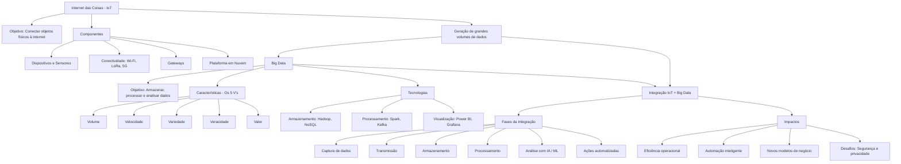

# mba-iot

```mermaid
graph TD
    A[Internet das Coisas - IoT] --> A1[Objetivo: Conectar objetos físicos à internet]
    A --> A2[Componentes]
    A2 --> A2a[Dispositivos e Sensores]
    A2 --> A2b[Conectividade: Wi-Fi, LoRa, 5G]
    A2 --> A2c[Gateways]
    A2 --> A2d[Plataforma em Nuvem]

    A --> A3[Geração de grandes volumes de dados]
    A3 --> B[Big Data]

    B --> B1[Objetivo: Armazenar, processar e analisar dados]
    B --> B2[Características - Os 5 V's]
    B2 --> B2a[Volume]
    B2 --> B2b[Velocidade]
    B2 --> B2c[Variedade]
    B2 --> B2d[Veracidade]
    B2 --> B2e[Valor]

    B --> B3[Tecnologias]
    B3 --> B3a[Armazenamento: Hadoop, NoSQL]
    B3 --> B3b[Processamento: Spark, Kafka]
    B3 --> B3c[Visualização: Power BI, Grafana]

    A3 --> C[Integração IoT + Big Data]
    B --> C

    C --> C1[Fases da Integração]
    C1 --> C1a[Captura de dados]
    C1 --> C1b[Transmissão]
    C1 --> C1c[Armazenamento]
    C1 --> C1d[Processamento]
    C1 --> C1e[Análise com IA / ML]
    C1 --> C1f[Ações automatizadas]

    C --> C2[Impactos]
    C2 --> C2a[Eficiência operacional]
    C2 --> C2b[Automação inteligente]
    C2 --> C2c[Novos modelos de negócio]
    C2 --> C2d[Desafios: Segurança e privacidade]
```
