# mba-iot
```mermaid
graph TD
    A[Internet das Coisas - IoT] --> A1[Objetivo: Conectar objetos físicos à internet]
    A --> A2[Componentes]
    A2 --> A2a[Dispositivos e Sensores]
    A2 --> A2b[Conectividade: Wi-Fi, LoRa, 5G]
    A2 --> A2c[Gateways]
    A2 --> A2d[Plataforma em Nuvem]

    A --> A3[Geração de grandes volumes de dados]
    A3 --> B[Big Data]

    B --> B1[Objetivo: Armazenar, processar e analisar dados]
    B --> B2[Características - Os 5 V's]
    B2 --> B2a[Volume]
    B2 --> B2b[Velocidade]
    B2 --> B2c[Variedade]
    B2 --> B2d[Veracidade]
    B2 --> B2e[Valor]

    B --> B3[Tecnologias]
    B3 --> B3a[Armazenamento: Hadoop, NoSQL]
    B3 --> B3b[Processamento: Spark, Kafka]
    B3 --> B3c[Visualização: Power BI, Grafana]

    A3 --> C[Integração IoT + Big Data]
    B --> C

    C --> C1[Fases da Integração]
    C1 --> C1a[Captura de dados]
    C1 --> C1b[Transmissão]
    C1 --> C1c[Armazenamento]
    C1 --> C1d[Processamento]
    C1 --> C1e[Análise com IA / ML]
    C1 --> C1f[Ações automatizadas]

    C --> C2[Impactos]
    C2 --> C2a[Eficiência operacional]
    C2 --> C2b[Automação inteligente]
    C2 --> C2c[Novos modelos de negócio]
    C2 --> C2d[Desafios: Segurança e privacidade]
```
## Resumo visual: Fundamentos de Big Data e Internet das Coisas II

## Fundamentos de Big Data e IoT IV
```mermaid
mindmap
  root((Fundamentos de Big Data e IoT IV))

    BI
      Definição
        BI = transformar dados em decisões
      Arquitetura
        Fontes de Dados
        ETL
        Data Warehouse
        Ferramentas de BI
        Dashboards e Relatórios
      Aplicações nas Empresas
        Otimização de processos
        Previsão de tendências
        Redução de custos
        Tomada de decisão

    Dashboards
      Definição
        Painel visual de dados em tempo real
      Benefícios
        Clareza
        Agilidade
        Monitoramento
        Compartilhamento
      Aplicações na Ciência de Dados
        Métricas de modelos
        Dados de sensores
        Indicadores de negócio

    Design Thinking e Inovação
      Definição
        Processo centrado no usuário
      Etapas
        Empatia
        Definição
        Ideação
        Prototipagem
        Teste
      Relação com Inovação
        Soluções criativas
        Iteratividade
      Processo de Negócio
        Desenvolvimento de produtos
        Cultura criativa

    Inteligência Artificial
      Conceito
        Simular a inteligência humana
      Histórico
        1950: conceito inicial
        1980-90: redes neurais
        Atualidade: deep learning, NLP, IA generativa
      Aplicações
        Saúde
        Finanças
        Indústria
        Varejo
        Mobilidade
        IoT
```
## Aplicações de Internet das Coisas
```mermaid
mindmap
  root((Internet das Coisas - IoT))
    Aplicações
      Saúde
      Agricultura
      Indústria 4.0
      Cidades Inteligentes
    Computação em Nuvem
      Características
        Elasticidade
        Sob demanda
        Multitenancy
        Alta disponibilidade
      Datacenter
        Tradicional
          Infraestrutura física
          Alto custo inicial (CAPEX)
          Escalabilidade limitada
        Nuvem
          Virtualização
          Pagamento por uso (OPEX)
          Alta escalabilidade
      SLA, Custos e Segurança
        SLA define uptime e suporte
        Custos baseados em uso
        Segurança com criptografia e controle de acesso
    Aplicações Web e WoT
      Diferença
        IoT: conexão de objetos
        WoT: uso de protocolos Web
      REST e ROA
        REST
          HTTP
          Stateless
          Verbos: GET, POST, PUT, DELETE
        ROA
          Foco em recursos
          URL como identificador
      Controle de Acesso
        CBAC
          Baseado em contexto (ex: local, horário)
        ABAC
          Baseado em atributos (ex: cargo, projeto)
    Web Services
      REST
        Leve
        Usa JSON/XML
        APIs modernas
      SOAP
        Robusto
        Usa XML
        Ambientes legados
      Exemplos
        REST: Twitter, GitHub, IoT APIs
        SOAP: Bancos, sistemas governamentais
    Plataformas Comerciais
      Amazon AWS
        EC2, S3, Lambda, IoT Core
      Microsoft Azure
        VM, Blob Storage, IoT Hub
      Google Cloud
        Compute Engine, Cloud Storage, Firebase
      IBM Cloud
        Watson, Node-RED, IoT Platform
```
## Arquitetura de referência IoT-A (Internet of Things - Architecture)
```mermaid
graph TD
    A[Camada de Aplicação] --> B[Camada de Serviço]
    B --> C[Camada de Rede]
    C --> D[Camada de Percepção]

    subgraph Níveis da IoT-A
        A
        B
        C
        D
    end

    A:::app
    B:::service
    C:::network
    D:::perception

    classDef app fill:#c9f0ff,stroke:#333,stroke-width:2px
    classDef service fill:#c2f5c0,stroke:#333,stroke-width:2px
    classDef network fill:#ffe4b3,stroke:#333,stroke-width:2px
    classDef perception fill:#ffb3b3,stroke:#333,stroke-width:2px
```
- Camada de Percepção: sensores, RFID, atuadores — coleta dados do mundo físico.
- Camada de Rede: protocolos de comunicação e transporte dos dados coletados.
- Camada de Serviço: processamento, gerenciamento e armazenamento de dados.
- Camada de Aplicação: entrega os serviços ao usuário final (painéis, apps, relatórios).

## Arquitetura e Infraestrutura de IoT II
```mermaid
mindmap
  root((IoT - Arquitetura e Infraestrutura II))

    Protocolos de Comunicação
      Conceito
        - Regras para troca de dados
        - Eficiência e interoperabilidade
      Importância
        - Comunicação eficiente
        - Baixo consumo
        - Conectividade escalável
      Comparação
        MQTT
          - Leve
          - Assíncrono
          - Broker
        CoAP
          - Baseado em REST
          - Leve e multicast
        HTTP
          - Comum na web
          - Pesado para IoT
        LoRaWAN
          - Longo alcance
          - Baixo consumo
        AMQP
          - Alta confiabilidade
          - Complexo

    Protocolo MQTT
      Objetivos
        - Eficiência em redes instáveis
        - Comunicação leve
      Características
        - Publish/Subscribe
        - Baseado em TCP/IP
        - QoS 0, 1, 2
        - Necessita de Broker
      Estrutura
        - Cliente
        - Broker
        - Tópico
        - Mensagem

    Middleware
      Definição
        - Software intermediário
        - Conecta dispositivos e apps
      Serviços
        - Gerenciamento de dispositivos
        - Agregação de dados
        - Segurança
        - Gerenciamento de rede
      Vantagens
        - Escalabilidade
        - Integração facilitada
        - Interoperabilidade

    Objetos Inteligentes
      Definição
        - Dispositivos com sensores, atuadores e conectividade
      Exemplos
        - Sensores
        - Wearables
        - Câmeras
        - Carros conectados
      Aplicações
        - Saúde
        - Indústria
        - Agricultura
        - Cidades inteligentes
        - Varejo
```

## Arquitetura e Infraestrutura de IoT III
```mermaid
mindmap
  root((Arquitetura e Infraestrutura de IoT III))
  
    Arduino
      Introdução
        Elementos Arquiteturais
          Microcontrolador (ex: ATmega328)
          Memórias (Flash, SRAM, EEPROM)
          Pinos de I/O (Digitais e Analógicos)
          Regulador de tensão
        Comunicação
          Protocolos: UART, I2C, SPI, Wi-Fi, Bluetooth
          Componentes: sensores e atuadores
        Aplicações IoT
          Estação climática
          Automação residencial
          Controle de irrigação
          Monitoramento remoto
    
    Atuadores
      Motores DC
        Funcionamento
          Corrente contínua
          Controle via PWM
          Direção via Ponte H
        Circuitos de acionamento
          Ponte H (L298N, L293D)
          Relés e transistores
          Fonte externa
        Aplicações
          Robôs móveis
          Portões automáticos
          Sistemas de ventilação

    Sensores
      Tipos Comuns
        Temperatura/Umidade (DHT11/22)
        Luz (LDR)
        Distância (HC-SR04)
        Gás (MQ-2)
        Movimento (PIR)
      Escolha por Aplicação
        Ambiente externo (resistentes)
        Alta precisão (digitais)
        Projetos simples (analógicos)
      Integração
        Conexão com pinos Arduino
        Leitura e processamento de dados

    RFID
      Gestão de Armazenagem
        Identificação sem contato
        Inventário em tempo real
      Automação de Estoque
        Controle de entrada e saída
        Acesso e rastreamento
      Origem e Vantagens no Brasil
        Chegada: anos 2000
        Vantagens:
          Agilidade
          Precisão
          Redução de perdas
```
### Esquema de controle de motor DC com Arduino e transistor

## Arquitetura e Infraestrutura de IoT IV
```mermaid
mindmap
  root((Arquitetura e Infraestrutura de IoT IV))

    Aplicações IoT
      Principais Negócios
        Indústria 4.0
        Agricultura Inteligente
        Saúde Digital
        Logística e Varejo
        Energia Inteligente
      Exemplos Gerais
        Smart Home
        Carros Conectados
        Cidades Inteligentes
      Com Arduino
        Sensor de Temperatura
        Detector de Presença
        Nível de Água
        Automação Residencial

    Smart Cities
      Conceito
        Uso de TICs para gestão urbana inteligente
      Tecnologias
        Sensores IoT
        Big Data e AI
        5G
        Nuvem
        Sistemas Urbanos
      Exemplos
        Barcelona
        Songdo
        Curitiba

    Perspectivas Futuras
      Fundamentos
        Maior integração e automação
        Edge Computing
        Mais dispositivos conectados
      Aplicações Futuras
        Cirurgias remotas
        Robôs autônomos
        Agricultura de Precisão
        Moda Inteligente
      Desafios
        Segurança e Privacidade
        Interoperabilidade
        Escalabilidade
        Energia
        Atualizações Remotas

    Segurança em IoT
      Conceito
        CIA (Confidencialidade, Integridade, Disponibilidade)
      Boas Práticas
        Autenticação Forte
        Criptografia
        Atualizações de Firmware
        Segmentação de Rede
        Monitoramento
      Falhas Comuns
        Senhas padrão
        Sem criptografia
        Portas abertas
        Firmware inseguro
```
## Fundamentos de Inteligência Artificial
```mermaid
mindmap
  root((Fundamentos de IA e IoT))
    Introdução à IA
      Conceito:::idea
        "Simular inteligência humana"
        "Aprender, raciocinar, decidir"
        "Ex.: análise de sensores IoT"
      História
        "1950 - Teste de Turing"
        "1956 - Nome 'IA' criado"
        "2010+ - Deep Learning e IA embarcada"
      Tipos
        "IA Fraca → tarefas específicas"
        "IA Forte → como humano"
        "IA Superinteligente → hipotética"
      Estatística básica
        "Distribuição: padrão dos dados"
        "Frequência: nº ocorrências"
        "Média: valor central"
    Teste de Turing
      Conceito
        "Avaliar se máquina pensa como humano"
      Forças
        "Simples, foca no comportamento"
      Fraquezas
        "Mede imitação, não inteligência real"
      Aplicações
        "Chatbots, assistentes virtuais"
    Estatística para IA
      Medidas
        "Média → valor central"
        "Desvio padrão → dispersão"
        "Variância → dispersão²"
      Intervalo de confiança
        "Faixa de probabilidade para um valor real"
      Regressão Linear
        "Prever valores baseados em variáveis"
        "Ex.: prever consumo de energia pela temperatura"
      Curtose
        "Forma da distribuição"
    Probabilidade
      Conceitos
        "Contagem, Evento, Espaço amostral"
      Probabilidade simples
        "Chance de ocorrer um evento"
      Condicional
        "Chance dado que outro evento ocorreu"
      Teorema de Bayes
        "Atualizar probabilidade com nova evidência"
      Aplicação IoT
        "Previsão de falhas"
        "Previsão meteorológica"
```
## Estrutura de dados para IA
```mermaid
mindmap
  root((Estruturas de Dados e Python para IoT e IA))
    Estruturas Condicionais e Iterativas
      Tipos de Dados e Variáveis
        Inteiro (int)
        Decimal (float)
        Texto (str)
        Booleano (bool)
        Lista, Tupla, Dicionário
      Expressões
        Operadores aritméticos
        Operadores lógicos
      Condicionais
        if / elif / else
        Aplicação: verificar estado de sensores
      Iterativas
        for: percorrer coleções
        while: repetição com condição
        Aplicação: loop de leitura de sensores
    Funções e Classes
      Funções
        Definição com def
        Parâmetros e retorno
        Aplicação: função para ler dados do sensor
      Classes
        __init__ para inicialização
        Atributos e métodos
        Aplicação: modelar dispositivos IoT
      POO
        Encapsulamento
        Reutilização de código
    Estruturas de Dados I
      Listas
        Ordenadas e mutáveis
        Operações: append, indexação
        Aplicação: armazenar leituras de sensores
      Filas (FIFO)
        Implementação com deque
        Aplicação: processamento de eventos
      Pilhas (LIFO)
        Implementação com list
        Aplicação: histórico de comandos
    Estruturas de Dados II
      Árvores Binárias
        Cada nó com até 2 filhos
        Aplicação: árvores de decisão
      BFS - Busca em Largura
        Usar fila
        Explorar nível a nível
      DFS - Busca em Profundidade
        Usar recursão ou pilha
        Explorar até o fundo antes de voltar
```
## Redes Neurais
```mermaid
mindmap
  root((IA e IoT - Redes Neurais e Estruturas de Dados))
    Estruturas_de_dados_para_IA_III
      Tabelas_Hash
        Definição: chave→valor
        Função_hash
        Vantagens: busca O(1)
      Colisões
        Encadeamento: lista na mesma posição
        Endereçamento_aberto: linear, quadrático, double hashing
      Implementação_Python
        Classe_HashTable
        Inserir/Buscar_valores
    Redes_Neurais_Artificiais
      Elementos
        Neurônio
        Pesos_w
        Bias_b
        Função_de_ativação
      Estruturas
        Feedforward
        Convolucional_CNN
        Recorrente_RNN_LSTM
        RBF
      Algoritmos
        Perceptron_Learning_Rule
        Backpropagation
        Gradient_Descent
    Perceptrons
      Modelo
        Frank_Rosenblatt_1958
        Linearmente_separável
      Representações
        Tabela_verdade
        Equação_matemática
        Diagrama_rede
      Aprendizado
        Ajuste_de_pesos
        Exemplo: Porta_AND
    Redes_Multicamadas
      Características
        Entrada_oculta_saida
        Resolve_não_linear
      Backpropagation
        Passo_forward
        Cálculo_erro
        Passo_backward
        Atualização_pesos
      Utilização
        Séries_temporais
        Classificação_imagens
        Detecção_anomalias
```
### Funcionamento básico de um neurônio artificial, inspirado nas sinapses nervosas e no somatório.
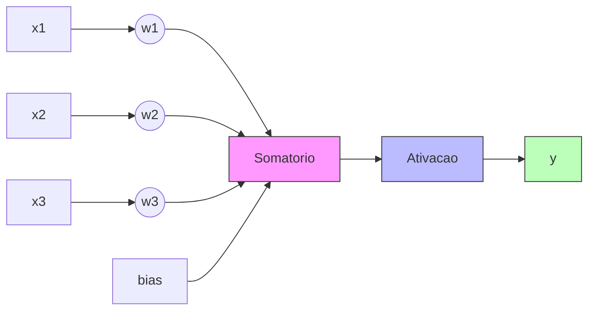
### Rede Neural Multicamadas (MLP)
```mermaid
flowchart LR
    %% Camada de entrada
    I1[x1]:::input --> H1((h1)):::hidden
    I2[x2]:::input --> H1
    I3[x3]:::input --> H1

    I1 --> H2((h2)):::hidden
    I2 --> H2
    I3 --> H2

    %% Camada oculta para saída
    H1 --> O1((y1)):::output
    H2 --> O1

    %% Estilos
    classDef input fill:#bbf,stroke:#333,stroke-width:1px;
    classDef hidden fill:#f9f,stroke:#333,stroke-width:1px;
    classDef output fill:#bfb,stroke:#333,stroke-width:1px;
```
Como ler o diagrama:
- 🔵 Nós azuis (x1, x2, x3) → Entradas.
- 🟣 Nós rosas (h1, h2) → Camada oculta (neurônios ocultos).
- 🟢 Nós verdes (y1) → Saída.
Todas as entradas estão conectadas a todos os neurônios ocultos, e estes à saída — típico de uma MLP (Multilayer Perceptron).

### Rede Neural Multicamadas (MLP) com duas camadas ocultas
```mermaid
flowchart LR
    %% Camada de entrada
    I1[x1]:::input --> H11((h11)):::hidden
    I2[x2]:::input --> H11
    I3[x3]:::input --> H11

    I1 --> H12((h12)):::hidden
    I2 --> H12
    I3 --> H12

    %% Segunda camada oculta
    H11 --> H21((h21)):::hidden
    H12 --> H21

    H11 --> H22((h22)):::hidden
    H12 --> H22

    %% Camada de saída
    H21 --> O1((y1)):::output
    H22 --> O1

    %% Estilos
    classDef input fill:#bbf,stroke:#333,stroke-width:1px;
    classDef hidden fill:#f9f,stroke:#333,stroke-width:1px;
    classDef output fill:#bfb,stroke:#333,stroke-width:1px;
```
📌 Como ler agora:
- 🔵 x1, x2, x3 → Entradas.
- 🟣 h11, h12 → Primeira camada oculta.
- 🟣 h21, h22 → Segunda camada oculta.
- 🟢 y1 → Saída.
🔑 Assim você tem uma rede multicamada profunda (DNN), ideal para problemas complexos e não-lineares.
